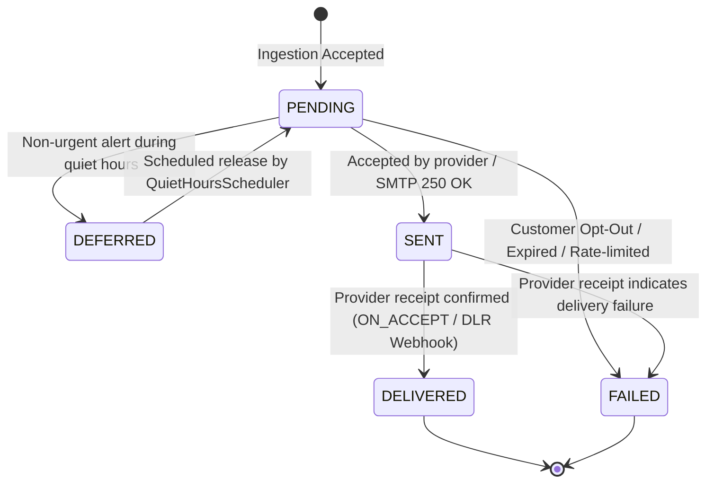

# Pigeon Architecture Documentation

This document describes the architectural principles, structural patterns, and reliability guarantees governing the **Pigeon** transactional notification engine.

---

## 1. Architectural Philosophy: Clean Hexagonal Architecture

Pigeon is designed strictly around the **Hexagonal Architecture (Ports and Adapters)** pattern. The primary objective is complete decoupling between business rules (the domain) and external technical mechanisms (web frameworks, databases, message brokers, caching, external APIs).

```
                  ┌─────────────────────────────────────────────────────────┐
                  │                   INFRASTRUCTURE                        │
                  │                                                         │
                  │   ┌─────────────────────────────────────────────────┐   │
                  │   │                  APPLICATION                    │   │
                  │   │                                                 │   │
                  │   │   ┌─────────────────────────────────────────┐   │   │
                  │   │   │                 DOMAIN                  │   │   │
                  │   │   │                                         │   │   │
                  │   │   │  • Notification & AuditRecord Entities  │   │   │
                  │   │   │  • Canonical State Machine              │   │   │
                  │   │   │  • Value Objects & Invariants           │   │   │
                  │   │   │  • Pure Java (0 external dependencies)  │   │   │
                  │   │   │                                         │   │   │
                  │   │   └─────────────────────────────────────────┘   │   │
                  │   │                                                 │   │
                  │   │  • Inbound Ports (Use Cases)                    │   │   │
                  │   │  • Application Orchestrators & Services         │   │   │
                  │   │  • Outbound Ports (Repositories, Publishers)    │   │   │
                  │   │                                                 │   │
                  │   └─────────────────────────────────────────────────┘   │
                  │                                                         │
                  │  • Inbound Adapters: REST API, RabbitMQ Listeners       │
                  │  • Outbound Adapters: PostgreSQL, Redis, RabbitMQ       │
                  │  • Channel Senders: MailHog SMTP, WireMock SMS & Push   │
                  │  • Metrics: Micrometer Adapter                          │
                  └─────────────────────────────────────────────────────────┘
```

### 1.1 Structural Packages and Responsibilities

- **`io.github.andres.pigeon.domain`**:
  - The innermost core. Contains pure Java domain aggregates (`Notification`), entities (`AuditRecord`, `DeliveryAttempt`), value objects (`NotificationId`, `CustomerId`, `Priority`), enums (`NotificationStatus`, `Channel`, `DeliveryConfirmationPolicy`), and domain exceptions.
  - **Zero framework dependencies**: strictly forbidden from importing Spring, Jakarta, Jackson, Resilience4j, or Micrometer.
- **`io.github.andres.pigeon.application`**:
  - Contains application use cases (inbound ports, e.g. `IngestEventUseCase`, `ProcessWebhookReceiptUseCase`, `QueryNotificationUseCase`), outbound interface ports (e.g. `NotificationRepository`, `OutboxRepository`, `AuditLogPort`, `MessagePublisherPort`, `MetricsPort`, `DeliveryPolicyPort`), and domain orchestration services (`IngestEventService`, `DeliveryOrchestratorService`, `OutboxRelayService`).
- **`io.github.andres.pigeon.infrastructure`**:
  - Contains concrete technical implementations: REST controllers, Spring Data JPA repositories, Redis templates, AMQP publishers and listeners, Thymeleaf template rendering, HTTP client adapters, Spring Security filters, and Micrometer metric adapters.

### 1.2 Boundary Enforcement via ArchUnit

Pigeon programmatically enforces these layer constraints using **ArchUnit** in `HexagonalArchitectureTest`:
1. `domain` classes must only depend on standard JDK packages and classes within the `domain` package.
2. `application` classes must not depend on `infrastructure`.
3. Outbound ports live exclusively in `application.port.out`; inbound ports live in `application.port.in`.
4. Any violation fails the build immediately in CI (`mvn verify`).

---

## 2. Notification Lifecycle & Finite State Machine

Pigeon guarantees deterministic state transitions for all financial alerts. A notification moves through 5 canonical states:



### 2.1 State Transition Invariants
1. **Terminal Immutability:** `DELIVERED` and `FAILED` are strictly terminal. No transition may exit a terminal state.
2. **Sequential Delivery:** A notification can only reach `DELIVERED` from `SENT`. Direct transitions from `PENDING` to `DELIVERED` are rejected.
3. **Atomic Auditing:** Every state transition automatically produces an immutable audit record in the same database transaction.
4. **Append-Only Attempts:** Delivery attempts are permanently recorded with provider reference, roundtrip latency, and failure codes.

---

## 3. Reliability and Fault Tolerance Patterns

### 3.1 Transactional Outbox with Publisher Confirms

To avoid the **Dual-Write Hazard** (where a database write succeeds but broker publishing fails, or vice-versa), Pigeon employs the Transactional Outbox Pattern:

1. When an event is ingested, the `notification` record and an `outbox_event` record are committed atomically inside a single ACID database transaction.
2. `OutboxRelayService` polls unpublished outbox records using `SELECT ... FOR UPDATE SKIP LOCKED` in batches of 50. This allows multiple Pigeon instances to run concurrently without table lock contention.
3. `RabbitMessagePublisher` submits each message using RabbitMQ **Publisher Confirms** (`CorrelationData`), synchronously awaiting broker acknowledgement (`confirm.isAck()`) and verifying that messages were routed without returns before marking `published_at = NOW()`.
4. A daily scheduled task purges published outbox events older than 7 days (`pigeon.outbox.retention-days`).

### 3.2 Multi-Channel Fallback Cascade

When delivering notifications, Pigeon evaluates customer preferences and channel availability across a cascading fallback hierarchy:

$$\text{PUSH} \longrightarrow \text{SMS} \longrightarrow \text{EMAIL}$$

Each channel invocation is protected by:
- **Resilience4j Circuit Breaker:** Detects downstream provider degradation (e.g. WireMock or third-party SMS aggregator outages). When the circuit opens, calls short-circuit immediately without blocking threads.
- **Resilience4j Retries:** In-process fast retries with exponential backoff for transient network hiccups.
- **Channel Cascade:** If a channel fails or its circuit is open, `DeliveryOrchestratorService` seamlessly falls back to the next allowed channel in the customer's preference order.

### 3.3 Two-Tier Retry Ladder and DLQ

- **HIGH Priority Messages (OTP, Fraud):**
  - Published to `pigeon.notifications.high` with a TTL of 60,000 ms.
  - If unconsumed before TTL expiration, the broker dead-letters the message to `pigeon.notifications.exchange.dlx` with routing key `pigeon.expired`.
  - `RabbitExpiredListener` consumes expired messages and records them as `FAILED` (`EXPIRED`). High-priority messages are **never** placed into multi-minute retry ladders because stale OTPs and security alerts are hazardous to customer security.
- **LOW Priority Messages (Transfers, Reminders):**
  - Published to `pigeon.notifications.low`.
  - Failed attempts enter an AMQP TTL retry ladder (`pigeon.notifications.retry.10s`, `30s`, `60s`).
  - Upon exhausting the ladder, the message is routed to `pigeon.notifications.dlq` for operator inspection.

### 3.4 Hybrid Idempotency Engine

To guarantee exactly-once processing semantics:
1. **In-Memory Cache (Redis):** Checks `pigeon:idempotency:{clientId}:{idempotencyKey}` with a 24-hour TTL for sub-millisecond replay detection. Replayed requests return `200 OK` with header `Idempotency-Replayed: true` and the original response body.
2. **Relational Invariant (PostgreSQL):** A database unique constraint `uk_notification_client_idempotency (client_id, idempotency_key)` protects against race conditions across distributed instances.
3. **Payload Integrity (SHA-256):** Reusing an idempotency key with a differing payload is rejected immediately with `409 Conflict`.

---

## 4. Cryptographic Security & Audit Immutability

### 4.1 Boundary PAN and Account Masking

Banking regulations (PCI-DSS) forbid storing or transmitting plaintext card numbers. Pigeon enforces validation at the HTTP boundary before payloads reach the domain:
- **Luhn Algorithm Check:** Detects 13-19 digit sequences satisfying the Luhn checksum and returns `400 Bad Request` Problem Details.
- **Account Run Detection:** Detects numeric sequences $\ge 10$ digits and requires masking (e.g. `**** 4821`).

### 4.2 Tamper-Evident Hash Chain Audit

Auditing cannot rely solely on application discipline or simple database rows:
1. **Trigger Defense:** PostgreSQL triggers `trg_audit_log_immutable` and `trg_delivery_attempt_immutable` abort any `UPDATE` or `DELETE`.
2. **Truncation Defense:** Statement-level triggers `trg_audit_log_truncate` and `trg_delivery_attempt_truncate` abort any `TRUNCATE` command.
3. **Cryptographic Chaining:** Each audit record persists a `prev_hash` column:
   $$\text{Hash}_N = \text{SHA-256}(\text{Hash}_{N-1} \,\|\, \text{notification\_id} \,\|\, \text{from\_status} \,\|\, \text{to\_status} \,\|\, \text{occurred\_at} \,\|\, \text{failure\_reason} \,\|\, \text{actor} \,\|\, \text{channel})$$
   Any modification or deletion of historical audit logs invalidates downstream hashes, making unauthorized manipulation detectable by compliance auditors.

### 4.3 Authenticated Webhook Receipts

Provider delivery receipts (`POST /api/v1/webhooks/{channel}/receipts`) are verified using HMAC-SHA256 signatures:
- The external provider passes the HMAC in header `X-Signature`.
- Pigeon computes `HMAC-SHA256(raw_json_bytes, PIGEON_WEBHOOK_SECRET)` using constant-time comparison (`MessageDigest.isEqual`) to defend against timing attacks.

---

## 5. Observability and Metrics Stack

Pigeon exposes Prometheus metrics via Micrometer and the Spring Boot Actuator (`GET /actuator/prometheus`):

| Metric Name | Type | Description |
|---|---|---|
| `pigeon.notifications.accepted` | Counter | Total accepted ingestion requests (tagged by event type and priority). |
| `pigeon.notifications.duplicates` | Counter | Idempotent replay requests detected. |
| `pigeon.delivery.attempts` | Counter | Channel delivery attempts (tagged by channel and outcome). |
| `pigeon.delivery.latency` | Timer | End-to-end delivery latency (p50, p95, p99 percentiles). |
| `pigeon.notifications.final` | Counter | Notifications reaching terminal status (`DELIVERED`, `FAILED`). |
| `pigeon.fallback.triggered` | Counter | Circuit breaker or failure fallback activations between channels. |
| `pigeon.circuitbreaker.state` | Gauge | State of channel circuit breakers (0: Closed, 1: Half-Open, 2: Open). |
| `pigeon.outbox.pending` | Gauge | Count of pending unpublished outbox records in PostgreSQL. |
| `pigeon.queue.depth` | Gauge | Real-time queue message depth across RabbitMQ queues. |
| `pigeon.ratelimit.rejected` | Counter | Ingestion requests rejected due to customer rate limits. |

Pigeon ships with automated Prometheus scraping and a pre-provisioned Grafana dashboard (`infra/grafana/dashboards/pigeon-overview.json`).
