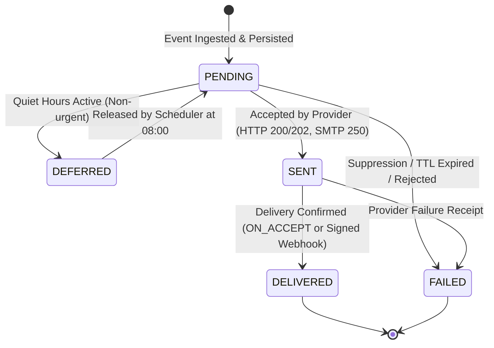

# Pigeon

<p align="center">
  <strong>Production-Grade Transactional Notification Engine for Banking & Fintech</strong>
</p>

<p align="center">
  
  
  
  
  
  
  
  
  
</p>

---

## 1. Executive Summary

**Pigeon** is an event-driven, multichannel transactional notification engine designed for mission-critical banking environments. It processes financial business events (such as money transfers, purchase declines, suspected fraud, one-time passwords, and payment reminders) and guarantees reliable delivery to end customers across multiple channels (**Push**, **SMS**, and **Email**).

In financial services, sending a notification is rarely a simple API call to a communications provider. Systems face distributed failure modes: network partitions, provider downtime, duplicate message deliveries, regulatory compliance audits, and strict PCI-DSS requirements. 

Pigeon solves these operational challenges using proven enterprise integration patterns:
* **Zero Dual-Write Hazards:** Combines an ACID **Transactional Outbox** pattern with database batching (`SELECT ... FOR UPDATE SKIP LOCKED`) and RabbitMQ **Publisher Confirms**.
* **Guaranteed Idempotency:** Sub-millisecond distributed Redis caching coupled with PostgreSQL unique constraints and SHA-256 payload checksums.
* **Resilient Multi-Channel Fallback:** Dynamic cascade (`PUSH → SMS → EMAIL`) governed by customer preferences and protected by **Resilience4j Circuit Breakers**, Bulkheads, and Retries.
* **Priority Routing & Poison Queue Isolation:** Dedicated high-priority queues with TTL-based expiration for time-sensitive security alerts (OTPs, Fraud) alongside an AMQP retry ladder and Dead Letter Queue (DLQ) for low-priority alerts.
* **Tamper-Evident Audit Trail:** Append-only regulatory audit log secured by PostgreSQL database triggers (prohibiting `UPDATE`, `DELETE`, and `TRUNCATE`) and an immutable **SHA-256 hash chain** (`prev_hash`).
* **Compliance-First Security:** Rejection of unmasked Primary Account Numbers (PANs) via the Luhn algorithm, Logback log masking, OAuth2 RS256 token verification, and HMAC-SHA256 signed delivery webhooks.
* **Full-Stack Observability:** 10 domain Micrometer metrics scraped by Prometheus and visualizable out-of-the-box via pre-provisioned Grafana dashboards.

---

## 2. Architecture & Design Principles

Pigeon is engineered strictly around **Hexagonal Architecture (Ports and Adapters)**. Domain logic is completely isolated from technical frameworks, databases, and message brokers, verified programmatically by **ArchUnit** tests on every build.

```
                  ┌─────────────────────────────────────────────────────────┐
                  │                   INFRASTRUCTURE                        │
                  │                                                         │
                  │   ┌─────────────────────────────────────────────────┐   │
                  │   │                  APPLICATION                    │   │
                  │   │                                                 │   │
                  │   │   ┌─────────────────────────────────────────┐   │   │
                  │   │   │                 DOMAIN                  │   │   │
                  │   │   │                                         │   │   │
                  │   │   │  • Notification & AuditRecord Entities  │   │   │
                  │   │   │  • Canonical State Machine              │   │   │
                  │   │   │  • Value Objects & Invariants           │   │   │
                  │   │   │  • Pure Java (0 external dependencies)  │   │   │
                  │   │   │                                         │   │   │
                  │   │   └─────────────────────────────────────────┘   │   │
                  │   │                                                 │   │
                  │   │  • Inbound Ports (Use Cases)                    │   │   │
                  │   │  • Application Orchestrators & Services         │   │   │
                  │   │  • Outbound Ports (Repositories, Publishers)    │   │   │
                  │   │                                                 │   │
                  │   └─────────────────────────────────────────────────┘   │
                  │                                                         │
                  │  • Inbound Adapters: REST Controllers, AMQP Listeners   │
                  │  • Outbound Adapters: PostgreSQL, Redis, RabbitMQ       │
                  │  • Channel Senders: MailHog SMTP, WireMock SMS & Push   │
                  │  • Observability: Micrometer Adapter                    │
                  └─────────────────────────────────────────────────────────┘
```

### 2.1 Package Organization

```text
io.github.andres.pigeon
├── domain
│   ├── enums               EventType, Channel, Priority, NotificationStatus, DeliveryConfirmationPolicy
│   ├── exception           DomainException, SensitiveDataException, DuplicateEventException...
│   ├── model               Notification, DeliveryAttempt, AuditRecord, Template, CustomerPreference
│   └── vo                  NotificationId, CustomerId, Priority, IdempotencyKey
├── application
│   ├── port
│   │   ├── in              IngestEventUseCase, ProcessWebhookReceiptUseCase, QueryNotificationUseCase
│   │   └── out             NotificationRepository, OutboxRepository, AuditLogPort, MetricsPort...
│   └── service             IngestEventService, DeliveryOrchestratorService, OutboxRelayService...
└── infrastructure
    ├── adapter
    │   ├── in.rest         EventIngestionController, WebhookReceiptController, GlobalExceptionHandler
    │   ├── in.messaging    RabbitNotificationListener, RabbitExpiredListener, RabbitDlqListener
    │   ├── out.persistence Postgres repositories, JPA entities, SpringData interfaces, Flyway migrations
    │   ├── out.messaging   RabbitMessagePublisher
    │   ├── out.cache       RedisIdempotencyStore, RedisRateLimiter
    │   ├── out.channel     EmailChannelSender, SmsChannelSender, PushChannelSender
    │   ├── out.template    ThymeleafTemplateRenderer
    │   └── out.metrics     MicrometerMetricsAdapter
    └── config              SecurityConfig, RabbitConfig, OpenApiConfig, CorrelationIdFilter
```

### 2.2 Lifecycle State Machine & Invariants



**Core Domain Invariants:**
1. **Terminal States:** `DELIVERED` and `FAILED` are strictly terminal. No transition may exit a terminal state.
2. **Strict Transition Order:** A notification can only reach `DELIVERED` from `SENT`. Direct transitions from `PENDING` to `DELIVERED` are rejected.
3. **Audit Atomicity:** Every single state transition generates an immutable audit record within the same database transaction.
4. **Append-Only History:** Delivery attempts and audit records cannot be mutated or deleted.

---

## 3. Key Technical Capabilities

### 3.1 Transactional Outbox with Publisher Confirms
To prevent message loss and eliminate dual-write inconsistencies between PostgreSQL and RabbitMQ:
1. The incoming event, initial `notification` state (`PENDING`), and `outbox_event` record are committed atomically in PostgreSQL.
2. `OutboxRelayService` polls unpublished outbox records using `SELECT ... FOR UPDATE SKIP LOCKED` in batches of 50.
3. `RabbitMessagePublisher` uses RabbitMQ **Publisher Confirms** (`CorrelationData`), waiting synchronously for broker ACK (`confirm.isAck()`) and tracking unroutable returns before marking the outbox row as published.
4. A daily scheduled task automatically cleans published records older than 7 days.

### 3.2 Cascading Channel Fallback & Resilience
When delivering a message, Pigeon evaluates the recipient's allowed channels in preference order:

$$\text{PUSH} \longrightarrow \text{SMS} \longrightarrow \text{EMAIL}$$

* **Resilience4j Circuit Breakers:** Protect each channel independently. If SMS provider error rates exceed 50% or latency spikes, the SMS circuit breaker opens immediately.
* **Automatic Fallback:** Upon failure or circuit trip, `DeliveryOrchestratorService` falls back to the next eligible channel in the cascade.
* **Two-Tier Retries:**
  * **HIGH Priority (OTP, Fraud):** Delivered via `pigeon.notifications.high` with a 60-second TTL. If expired, messages land in `pigeon.expired` and are marked `FAILED` (`EXPIRED`). High-priority messages are **never delayed** in multi-minute retry queues.
  * **LOW Priority (Transfers, Reminders):** Delivered via `pigeon.notifications.low`. Failed attempts enter an AMQP TTL retry ladder (`10s`, `30s`, `60s`) before moving to the Dead Letter Queue (`pigeon.notifications.dlq`).

### 3.3 Hybrid Idempotency Engine
* **Redis Fast-Path:** Computes `pigeon:idempotency:{clientId}:{idempotencyKey}` with a 24-hour TTL for sub-millisecond duplicate detection.
* **Database Constraint:** Relational constraint `uk_notification_client_idempotency` ensures absolute consistency during concurrent race conditions.
* **Payload Verification:** Computes a SHA-256 digest of the request payload. Reusing an existing key with different data returns `409 Conflict`. Identical requests return `200 OK` with the header `Idempotency-Replayed: true`.

### 3.4 Customer Preferences & Quiet Hours
* **Quiet Hours:** Non-urgent notifications outside business hours (before 08:00, after 18:00, or on weekends in the customer's IANA timezone) transition to `DEFERRED` and schedule release for the next business day at 08:00.
* **Security Exemptions:** Mandatory security messages (`OTP_REQUESTED`, `FRAUD_SUSPECTED`) completely bypass quiet hours and customer opt-outs.

### 3.5 Tamper-Evident Hash-Chained Audit Trail
* **Database Triggers:** PostgreSQL table triggers `trg_audit_log_immutable` and statement trigger `trg_audit_log_truncate` reject any `UPDATE`, `DELETE`, or `TRUNCATE` command on `audit_log` and `delivery_attempt`.
* **Cryptographic Hash Chain:** Each record stores a `prev_hash` column:
  $$\text{Hash}_N = \text{SHA-256}(\text{Hash}_{N-1} \,\|\, \text{notification\_id} \,\|\, \text{from\_status} \,\|\, \text{to\_status} \,\|\, \text{occurred\_at} \,\|\, \text{failure\_reason} \,\|\, \text{actor} \,\|\, \text{channel})$$
  Any database alteration breaks the chain, providing mathematically verifiable integrity for banking regulatory examiners.

### 3.6 Signed Webhook Delivery Receipts
For asynchronous channels (SMS, Push), external providers notify Pigeon of final delivery via webhooks (`POST /api/v1/webhooks/{channel}/receipts`):
* Secured via HMAC-SHA256 signature in the `X-Signature` header computed over the raw request payload using `PIGEON_WEBHOOK_SECRET`.
* Verified using constant-time comparison (`MessageDigest.isEqual`) to prevent timing side-channel attacks.

---

## 4. Technology Stack

| Layer / Concern | Technology | Version | Purpose |
|---|---|---|---|
| **Language & Platform** | Java / OpenJDK | `21` (LTS) | Base runtime platform |
| **Framework** | Spring Boot | `3.3.4` | Application runtime, Web, Data JPA, Security |
| **Relational Database** | PostgreSQL | `16-alpine` | Primary transactional store & Flyway schema |
| **Message Broker** | RabbitMQ | `3.13-management` | Priority queues, TTLs, DLX, and publisher confirms |
| **Distributed Cache** | Redis | `7-alpine` | Distributed idempotency keys & rate limiting |
| **Fault Tolerance** | Resilience4j | `2.2.0` | Circuit breakers, retries, bulkheads, timeouts |
| **Template Engine** | Thymeleaf | `3.x` | SSTI-safe HTML & text template rendering |
| **Observability** | Micrometer & Prometheus | `1.13.x` / `v2.54.1` | Application metrics scraper & time-series storage |
| **Visualization** | Grafana | `11.1.0` | Provisioned operational dashboards |
| **Simulated Providers** | MailHog / WireMock | `v1.0.1` / `3.9.1` | SMTP server & mock HTTP REST gateways |
| **Testing** | JUnit 5, Testcontainers, ArchUnit | `5.10` / `1.20.1` / `1.3.0` | Unit, integration, and architectural boundary tests |

---

## 5. Quickstart

### 5.1 Prerequisites
* **Docker** (v24+) and **Docker Compose** (v2+)
* **Java 21+** and **Maven 3.9+** (for building locally)

### 5.2 Running the Full Stack
Launch the entire infrastructure and Pigeon service with a single command:

```bash
git clone https://github.com/andres/pigeon.git
cd pigeon
docker compose up --build
```

### 5.3 Web Consoles & Port Reference

| Service | URL | Credentials / Notes |
|---|---|---|
| **Pigeon REST API / Swagger UI** | `http://localhost:8080/swagger-ui.html` | Interactive OpenAPI documentation |
| **MailHog Web UI** | `http://localhost:8025` | Inspect delivered email notifications |
| **RabbitMQ Management** | `http://localhost:15672` | `guest` / `guest` (Queues, exchanges, DLQs) |
| **Prometheus** | `http://localhost:9090` | Metrics scraper & PromQL console |
| **Grafana** | `http://localhost:3000` | `admin` / `admin` (Pre-provisioned Pigeon dashboard) |
| **WireMock Admin** | `http://localhost:8089/__admin` | Simulated SMS & Push endpoints |

---

## 6. Interactive Demo Script

Pigeon includes an automated scenario runner (`scripts/demo.sh`) that demonstrates all core behaviors against a running stack:

```bash
./scripts/demo.sh
```

**Scenarios executed by the script:**
1. **Standard Transfer Flow:** Ingests `TRANSFER_COMPLETED`, processes the outbox event, and delivers an email to MailHog with masked account digits (`**** 4821`).
2. **Idempotent Replay:** Resends the exact same event and key; verifies HTTP `200 OK` replay with header `Idempotency-Replayed: true`.
3. **High-Priority Security Alert:** Ingests `FRAUD_SUSPECTED`; verifies delivery through `pigeon.notifications.high` bypassing quiet hours and opt-outs.
4. **Audit Trail Query:** Queries `GET /api/v1/notifications/{id}` to verify state history, latency measurements, and the SHA-256 hash chain.
5. **Signed Webhook Callback:** Dispatches an HMAC-SHA256 signed delivery receipt to `POST /api/v1/webhooks/sms/receipts`, transitioning notification status to `DELIVERED`.

---

## 7. API Reference & Examples

### 7.1 Generate Developer JWT
Pigeon validates incoming requests as an OAuth2 Resource Server. Generate a valid RS256 token using the helper script:

```bash
export JWT=$(./scripts/dev-token.sh "bank-core-producer" "notifications:write notifications:read")
```

### 7.2 Ingest Financial Event (`POST /api/v1/events`)

```bash
curl -X POST http://localhost:8080/api/v1/events \
  -H "Authorization: Bearer $JWT" \
  -H "Content-Type: application/json" \
  -H "Idempotency-Key: tx-9988-20261005" \
  -d '{
    "customerId": "cust-1001",
    "eventType": "TRANSFER_COMPLETED",
    "locale": "es",
    "occurredAt": "2026-10-05T20:30:00Z",
    "data": {
      "accountNumber": "9876543210",
      "amount": "250000.00",
      "currency": "COP",
      "recipient": "Maria Rodriguez"
    }
  }'
```

**Response (`202 Accepted`):**
```json
{
  "notificationId": "c4b3f870-8d5a-4b9b-9c7f-0efb81f12345",
  "status": "PENDING",
  "priority": "LOW"
}
```

### 7.3 Query Notification & Audit Trail (`GET /api/v1/notifications/{id}`)

```bash
curl -X GET http://localhost:8080/api/v1/notifications/c4b3f870-8d5a-4b9b-9c7f-0efb81f12345 \
  -H "Authorization: Bearer $JWT"
```

### 7.4 Submit Provider Delivery Receipt (`POST /api/v1/webhooks/{channel}/receipts`)

```bash
PAYLOAD='{"notificationId":"c4b3f870-8d5a-4b9b-9c7f-0efb81f12345","providerRef":"gw-123","status":"DELIVERED","occurredAt":"2026-10-05T20:31:00Z"}'
SIGNATURE=$(echo -n "$PAYLOAD" | openssl dgst -sha256 -hmac "pigeon_dev_webhook_secret_key_32bytes" | sed 's/^.* //')

curl -X POST http://localhost:8080/api/v1/webhooks/sms/receipts \
  -H "Content-Type: application/json" \
  -H "X-Signature: $SIGNATURE" \
  -d "$PAYLOAD"
```

---

## 8. Observability & Metrics

Pigeon exposes metrics formatted for Prometheus at `GET /actuator/prometheus`.

| Metric Name | Type | Description |
|---|---|---|
| `pigeon.notifications.accepted` | Counter | Total accepted ingestion requests (tagged by event type and priority). |
| `pigeon.notifications.duplicates` | Counter | Replayed idempotent requests detected. |
| `pigeon.delivery.attempts` | Counter | Delivery attempts per channel tagged with outcome (`SUCCESS`, `FAILURE`). |
| `pigeon.delivery.latency` | Timer | End-to-end delivery latency (p50, p95, p99 percentiles). |
| `pigeon.notifications.final` | Counter | Final delivery transitions (`DELIVERED`, `FAILED`). |
| `pigeon.fallback.triggered` | Counter | Circuit breaker or failure fallback activations. |
| `pigeon.circuitbreaker.state` | Gauge | Channel circuit breaker states (0: Closed, 1: Half-Open, 2: Open). |
| `pigeon.outbox.pending` | Gauge | Count of pending outbox events awaiting broker acknowledgement. |
| `pigeon.queue.depth` | Gauge | Depth of AMQP queues across normal, high-priority, retry, and DLQs. |
| `pigeon.ratelimit.rejected` | Counter | Ingestion events rejected by customer sliding-window limits. |

---

## 9. Testing & Quality Gates

Pigeon enforces a rigorous testing regimen across multiple tiers:
* **Domain Unit Tests:** Pure JUnit 5 tests asserting business invariants, state transitions, Luhn checks, and template rendering without Spring context overhead.
* **ArchUnit Tests:** Programmatically validates hexagonal boundary purity in `HexagonalArchitectureTest`.
* **Integration Tests:** Spin up ephemeral PostgreSQL and RabbitMQ containers using **Testcontainers** (`AuditImmutabilityIntegrationTest`, `OutboxCrashRecoveryIntegrationTest`, `WebhookReceiptIntegrationTest`, `EventIngestionIntegrationTest`).
* **Code Coverage (JaCoCo):** Enforces a minimum **85% line coverage** on `domain.*` and `application.*`.

Run the complete build and quality check locally:
```bash
./mvnw clean verify
```

---

## 10. Documentation Index

For in-depth architectural specifications and operational runbooks, refer to:
* [Architecture Guide](ARCHITECTURE.md) – Hexagonal design, invariants, and outbox mechanics.
* [Database Data Model](docs/data-model.md) – PostgreSQL tables, Flyway migrations, triggers, and Redis keys.
* [Operations Runbook](docs/runbook.md) – DLQ triage, poison message recovery, and incident handling.
* [OpenAPI 3.0 Specification](docs/api/openapi.yaml) – Full machine-readable API contracts.
* [Architecture Decision Records (ADRs)](docs/adr/) – Architectural Decision Records (ADR-0001 through ADR-0013).
* [Contributing Guidelines](CONTRIBUTING.md) – Contribution standards and PR guidelines.
* [Security Policy](SECURITY.md) – Vulnerability reporting and security architecture.
* [Changelog](CHANGELOG.md) – Version history and release notes.

---

## 11. License

This project is licensed under the **Apache License, Version 2.0**. See the [LICENSE](LICENSE) file for details.
