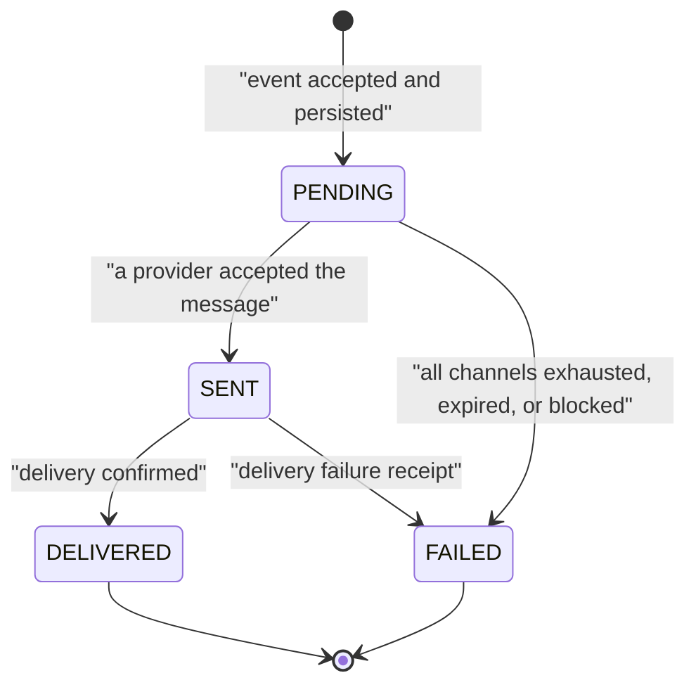
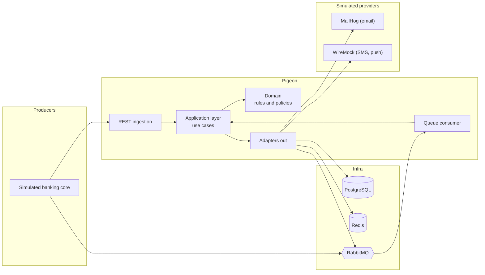
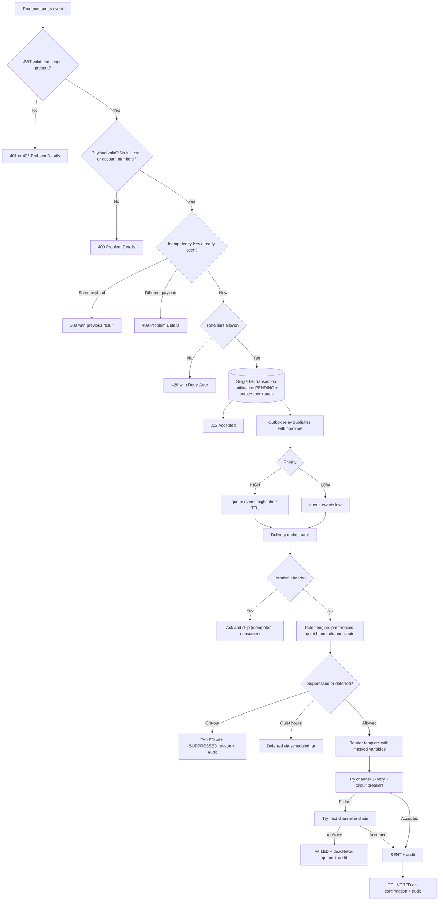
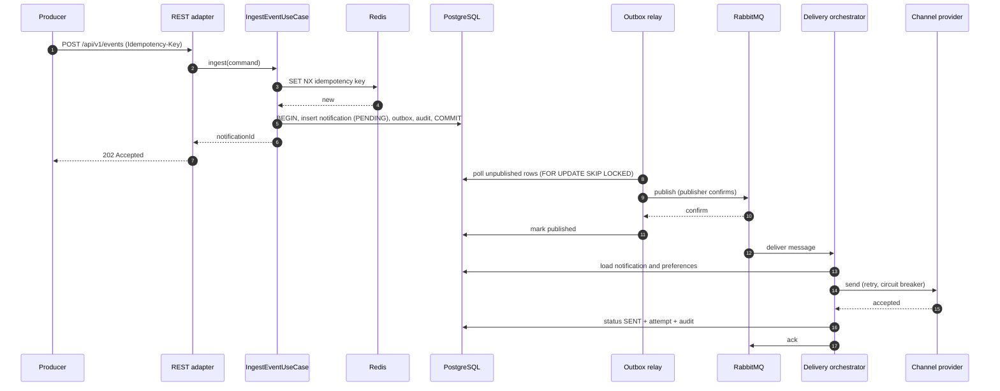
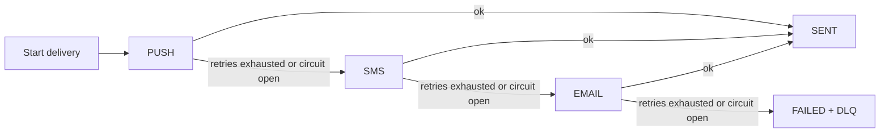

<p align="center">
  <picture>
    <source media="(prefers-color-scheme: dark)" srcset="docs/assets/logo-light.svg">
    
  </picture>
</p>

<h1 align="center">Pigeon</h1>

<p align="center">
  <strong>Every alert matters. Banking notifications that never get lost, never arrive twice, and always find their way to the customer.</strong>
</p>

<p align="center">
  <a href="https://github.com/<your-username>/pigeon/actions/workflows/ci.yml">/pigeon/actions/workflows/ci.yml/badge.svg"></a>
  
  
  
  
</p>

> **When a fraud alert can't afford to fail:** idempotent, multichannel banking notifications built on hexagonal architecture, Spring Boot, RabbitMQ and the Outbox pattern.

> ⚠️ **Educational project.** Pigeon uses simulated providers (MailHog, WireMock) and **synthetic data only**. It must never be connected to real customers, real card or account numbers, or real messaging providers.

---

## Table of contents

1. [Overview](#1-overview)
2. [Project state and decision log](#2-project-state-and-decision-log)
3. [The problem and what Pigeon guarantees](#3-the-problem-and-what-pigeon-guarantees)
4. [Scope](#4-scope)
5. [Domain model and glossary](#5-domain-model-and-glossary)
6. [Architecture](#6-architecture)
7. [End-to-end flow](#7-end-to-end-flow)
8. [Functional specification](#8-functional-specification)
9. [Messaging topology](#9-messaging-topology)
10. [Failure handling matrix](#10-failure-handling-matrix)
11. [Data model](#11-data-model)
12. [REST API contract](#12-rest-api-contract)
13. [Security](#13-security)
14. [Observability](#14-observability)
15. [Testing strategy](#15-testing-strategy)
16. [Continuous integration](#16-continuous-integration)
17. [Local infrastructure and configuration](#17-local-infrastructure-and-configuration)
18. [Running Pigeon and the demo](#18-running-pigeon-and-the-demo)
19. [Development phases and definition of done](#19-development-phases-and-definition-of-done)
20. [Repository layout](#20-repository-layout)
21. [Engineering conventions](#21-engineering-conventions)
22. [Rules for AI assistants (focus guardrails)](#22-rules-for-ai-assistants-focus-guardrails)
23. [Known limitations and risks](#23-known-limitations-and-risks)
24. [Roadmap beyond v1.0.0](#24-roadmap-beyond-v100)
25. [Contributing, license and disclaimer](#25-contributing-license-and-disclaimer)

---

## 1. Overview

**Pigeon** is a backend service for **transactional notifications in banking**. It receives business events (transfer completed, purchase declined, suspected fraud, one-time password, payment reminder) and delivers them to the customer through the right channel (email, SMS, push; WhatsApp and Slack are planned), without losing or duplicating messages.

The project does not exist to "send messages", which is easy. It exists to show how to do it **reliably**: idempotency, priorities, channel fallback, retries with backoff, circuit breakers, dead-letter queues, the Outbox pattern, immutable auditing, data masking and observability.

Pigeon is a **backend-only** project. There is no custom frontend. Everything can be inspected with tools that ship with the stack: Swagger UI, MailHog, the RabbitMQ management console, WireMock request logs and Grafana.

**Primary goals**

- Demonstrate production-grade engineering practices: tests, CI, documentation, security, observability.
- Be fully reproducible locally with `docker compose up`, with no paid accounts or external services.
- Keep a clean hexagonal architecture where business rules never depend on frameworks.

---

## 2. Project state and decision log

> This section is the **single source of truth for what is decided and what is not**. Update it whenever a decision changes. Assistants must read it before starting any task.

### 2.1 Current state

| Item | Value |
|---|---|
| Current phase | **Phase 1** (assumed, confirm before starting) |
| Latest release | none |
| Next milestone | Phase 1 definition of done (see [section 19](#19-development-phases-and-definition-of-done)) |

### 2.2 Decisions taken

| ID | Decision | Status | Notes |
|---|---|---|---|
| D-01 | Project name: **Pigeon** | Confirmed | Repository: `pigeon` |
| D-02 | License: **Apache 2.0** | Confirmed | Copyright 2026 Andres |
| D-03 | Message broker: **RabbitMQ** | Confirmed | Native TTL, dead-lettering and flexible routing fit priority and DLQ requirements (ADR-0002) |
| D-04 | Template engine: **Thymeleaf** | Confirmed | Escaped-by-default variables, text/HTML support and Spring integration |
| D-05 | Architecture: **hexagonal** (domain, application, infrastructure) | Confirmed | Enforced with ArchUnit (ADR-0001) |
| D-06 | Language policy | Confirmed | Documentation and code in English; explanations to the maintainer in Spanish |
| D-07 | Local JWT issuer | Confirmed | Dev/test RSA-2048 key pair with dev-token.sh; service validates as OAuth2 Resource Server (ADR-0005) |
| D-08 | Notification status model | Confirmed | 4 canonical statuses (PENDING, SENT, DELIVERED, FAILED) with failure_reason codes (ADR-0007) |
| D-09 | Event priority defaults | Confirmed | OTP and Fraud are HIGH; Transfer, Declined Purchase and Reminder default to LOW |
| D-10 | Maven structure | Confirmed | Single module, strict boundaries enforced by ArchUnit (ADR-0001) |
| D-11 | Base package and Maven coordinates | Confirmed | `io.github.andres.pigeon` |
| D-12 | Outbox pulled forward to Phase 1 | Confirmed | `outbox_event` and relay in Phase 1 eliminate dual-write risk R-01 from day one (ADR-0004) |
| D-13 | Contact resolution in Phase 1 | Confirmed | `customer_contact` included in V1 Flyway with synthetic demo fixtures to cleanly resolve recipients |
| D-14 | Sensitive data boundary validation | Confirmed | Luhn validation (13-19 digits) and account run detection (>=10 digits) returning 400 Problem Details (ADR-0006) |

### 2.3 Open decisions

All initial architectural decisions have been resolved and confirmed for maximum operational stability, privacy, and regulatory audit compliance. Future proposals will be evaluated via new ADRs.

---

## 3. The problem and what Pigeon guarantees

Sending a message is trivial. Doing it correctly while components fail is not. A bank notification service must answer these questions:

| Question | Pigeon's answer |
|---|---|
| What if the service crashes right after the business event? | The **Outbox** persists the event in the same transaction as the notification, so it is published after recovery. |
| What if the producer retries and sends the event twice? | **Idempotency keys** guarantee one notification per key. |
| What if an OTP waits in a queue behind thousands of reminders? | **Priority routing** and **short TTL** for critical messages. |
| What if the push provider is down? | **Retries**, **circuit breaker** and **channel fallback**: push, then SMS, then email. |
| What if nothing works? | The message goes to the **Dead Letter Queue** with a full audit trail. |
| What if the customer opted out or it is 3 AM? | **Preferences** and quiet hours apply, except to mandatory security messages. |
| What if a card number leaks into a log? | **Masking** at the boundary and a logging filter. |

### 3.1 Delivery semantics (be precise)

- Pigeon provides **at-least-once processing with idempotent effects**. This is equivalent to "exactly-once" for the customer in practice, but **Pigeon does not claim true exactly-once delivery**. Do not use that term in documentation.
- There is a small unavoidable window: if the process dies after a provider accepted a message but before Pigeon commits that fact, the message may be sent again on recovery. Pigeon mitigates this by sending the `notificationId` as an idempotency key to the provider (real providers support this) and documents the residual risk.
- Ordering across notifications is **not guaranteed**.
- End-to-end delivery to the customer's device cannot be guaranteed by any system. Pigeon guarantees that **nothing is lost without a trace**.

---

## 4. Scope

### 4.1 In scope (v1.0.0)

- REST ingestion API with validation and OAuth2/JWT security; queue consumer as a second ingestion path.
- Idempotency (Redis fast path, PostgreSQL as the source of truth).
- Two priority levels with dedicated queues and different expiry.
- Channels: **email, SMS, push** through a common interface, with simulated providers.
- Fallback chain, retries with exponential backoff, circuit breaker, dead-letter queue.
- Customer preferences: allowed channels, quiet hours, opt-out (security messages exempt).
- Versioned, multilingual templates with safe variables (`en`, `es`).
- Sensitive-data masking (`**** 4821`).
- Outbox pattern and immutable audit log.
- Per-customer rate limiting.
- Metrics for Prometheus and a Grafana dashboard.
- Docker Compose environment, automated tests, CI with coverage, OpenAPI documentation, demo script.

### 4.2 Out of scope

| Excluded | Reason |
|---|---|
| Real providers (Twilio, FCM, SES, WhatsApp Business) | Requires accounts and paid services; breaks reproducibility |
| Real customer data, real banking integration | Privacy and legal risk |
| A real core banking system | Simulated by a script or a small producer |
| End-user web or mobile application | Backend project; tools already included cover inspection |
| High availability in production (clusters, Kubernetes, multi-node scaling) | Out of educational scope |
| WhatsApp and Slack channels | Planned after v1.0.0; the common interface makes them additive |
| Marketing or bulk campaigns | Pigeon is transactional only |
| Distributed tracing across systems | Correlation IDs only in v1 (OpenTelemetry is on the roadmap) |

### 4.3 Deliverables

`README.md`, `ARCHITECTURE.md`, ADRs, `CONTRIBUTING.md`, `CODE_OF_CONDUCT.md`, `SECURITY.md`, `LICENSE`, `CHANGELOG.md`, `docker-compose.yml`, GitHub Actions workflow, OpenAPI specification and collection, Grafana dashboard JSON, demo script, and the `v1.0.0` release.

---

## 5. Domain model and glossary

### 5.1 Core concepts

| Term | Meaning |
|---|---|
| **Event** | A business fact sent by a producer (for example `TRANSFER_COMPLETED`). Pigeon never creates events; it reacts to them. |
| **Notification** | The persistent, logical message Pigeon owes a customer as the result of one event. One event produces one notification. |
| **Delivery attempt** | One try to deliver a notification through one channel. A notification has one or more attempts. |
| **Channel** | A delivery medium: `EMAIL`, `SMS`, `PUSH` (later `WHATSAPP`, `SLACK`). |
| **Priority** | `HIGH` or `LOW`; decides the queue and expiry. |
| **Mandatory security message** | A message that ignores opt-out and quiet hours: `OTP_REQUESTED` and `FRAUD_SUSPECTED`. |
| **Idempotency key** | A producer-supplied identifier that makes a request safely repeatable. |
| **Outbox** | A table written in the same transaction as the business state, used to publish messages reliably. |
| **DLQ** | Dead Letter Queue for messages that cannot be processed after all recovery steps. |
| **Template** | A versioned message body per event type, channel and locale. |
| **Masking** | Replacing sensitive digits so that only the last four remain. |

### 5.2 Event types

| Event type | Priority (default) | Mandatory security | Required `data` fields |
|---|---|---|---|
| `OTP_REQUESTED` | `HIGH` | Yes | `otpCode`, `expiresInSeconds` |
| `FRAUD_SUSPECTED` | `HIGH` | Yes | `amount`, `currency`, `cardLast4`, `merchantName` |
| `TRANSFER_COMPLETED` | `LOW` (O-03) | No | `amount`, `currency`, `accountLast4`, `beneficiaryName` |
| `PURCHASE_DECLINED` | `LOW` (O-03) | No | `amount`, `currency`, `cardLast4`, `merchantName`, `reasonCode` |
| `PAYMENT_REMINDER` | `LOW` | No | `amount`, `currency`, `dueDate`, `accountLast4` |

### 5.3 Notification status model



**Invariants (enforced in the domain layer)**

1. `DELIVERED` and `FAILED` are terminal; no transition leaves them.
2. `DELIVERED` can only be reached from `SENT`.
3. Delivery attempts and audit records are **append-only**.
4. Every transition writes exactly one audit record.
5. A mandatory security message can never be suppressed by preferences or quiet hours.
6. Sensitive values are masked before they enter the domain model, never after.

**Failure reason codes (initial set):** `PROVIDER_UNAVAILABLE`, `PROVIDER_REJECTED`, `ALL_CHANNELS_EXHAUSTED`, `EXPIRED`, `INVALID_DESTINATION`, `SUPPRESSED_OPT_OUT`, `SUPPRESSED_NO_ALLOWED_CHANNEL`, `TEMPLATE_NOT_FOUND`, `POISON_MESSAGE`.

**Delivery confirmation.** Some simulated channels have no receipts. The policy per channel is configurable: `ON_ACCEPT` (mark `DELIVERED` right after `SENT`, used for email in the simulation) or `ON_RECEIPT` (wait for a signed webhook, used for SMS and push). This is a documented simulation limitation.

---

## 6. Architecture

### 6.1 Hexagonal layers and the dependency rule

```text
infrastructure  ──▶  application  ──▶  domain
(adapters)           (use cases,        (entities, value objects,
                      ports)             pure business rules)
```

| Layer | Contains | May depend on | Must never contain |
|---|---|---|---|
| `domain` | Entities, value objects, domain services, policies, domain exceptions | JDK only | Spring, JPA, Jackson, Rabbit, any framework annotation |
| `application` | Use cases (input ports), output ports, orchestration | `domain`; Spring's `@Transactional` only (documented exception, see ADR) | Controllers, SQL, AMQP code, HTTP clients |
| `infrastructure` | REST, messaging, persistence, cache, channel adapters, configuration | `application`, `domain` | Business rules |

**Hard rules**

- Dependencies point inward only. This is enforced by **ArchUnit tests** that fail the build.
- JPA entities live in `infrastructure` and are mapped to domain objects. Domain classes are never annotated with persistence annotations.
- Controllers contain no business logic; they translate HTTP into use-case calls.
- Every channel implements one `ChannelSender` port (Strategy/Adapter). Adding a channel never modifies existing code.

### 6.2 Package structure

```text
io.github.<your-username>.pigeon
├── domain
│   ├── model            Notification, DeliveryAttempt, Template, CustomerPreference, QuietHours
│   ├── vo               Money, CustomerId, IdempotencyKey, MaskedCardNumber, MaskedAccountNumber, Destination
│   ├── enums            EventType, Channel, Priority, NotificationStatus, FailureReason
│   ├── policy           PriorityPolicy, ChannelSelectionPolicy, QuietHoursPolicy, MandatoryMessagePolicy
│   └── exception        InvalidStateTransitionException, SensitiveDataException, ...
├── application
│   ├── port
│   │   ├── in           IngestEventUseCase, ProcessNotificationUseCase, ManagePreferencesUseCase,
│   │   │                QueryNotificationUseCase, RecordDeliveryReceiptUseCase
│   │   └── out          NotificationRepository, OutboxRepository, AuditLogPort, IdempotencyStore,
│   │                    RateLimiter, MessagePublisher, TemplateRepository, TemplateRenderer,
│   │                    PreferenceRepository, ContactRepository, ChannelSender, ClockPort
│   └── service          Use-case implementations and the delivery orchestrator
└── infrastructure
    ├── adapter.in.rest         Controllers, request/response DTOs, ProblemDetail advice
    ├── adapter.in.messaging    Queue listeners (events, retry, expired, dead-letter handling)
    ├── adapter.out.persistence JPA entities, repositories, mappers, Flyway migrations
    ├── adapter.out.messaging   Outbox relay, RabbitMQ publisher, topology configuration
    ├── adapter.out.cache       Redis idempotency store and rate limiter
    ├── adapter.out.channel     EmailChannelSender, SmsChannelSender, PushChannelSender
    ├── adapter.out.template    Thymeleaf renderer
    └── config                  Security, Rabbit, Resilience4j, Micrometer, OpenAPI
```

### 6.3 Component view



---

## 7. End-to-end flow

### 7.1 High-level pipeline

```text
Banking core (simulated) → event → API / queue → Pigeon
   → idempotency → persist (notification + outbox) → broker
   → rules engine (channel, priority, preferences) → template → channel sender → provider
   → status + audit + metrics
```

### 7.2 Detailed flow



### 7.3 Ingestion and processing sequence



### 7.4 Failure and fallback path



The chain is the intersection of the event's channel mapping, the customer's allowed channels, and channels with a known destination. Default order: `PUSH → SMS → EMAIL`.

---

## 8. Functional specification

Each requirement lists the behavior, the rules, the acceptance criteria and the phase in which it ships.

### FR-01 Event ingestion (Phase 1)

- **Behavior.** Events arrive through `POST /api/v1/events` and, from Phase 2, also through an inbound queue (`pigeon.inbound`) consumed by an adapter that calls the same use case.
- **Rules.** Bean Validation on every field; unknown event types are rejected; `occurredAt` must be ISO-8601 UTC and not in the far future; payload size is capped; `data` is validated per event type ([section 5.2](#52-event-types)); any value that looks like a full card or account number is rejected, never stored.
- **Acceptance.** *Given* a valid event, *when* it is posted, *then* the response is `202` with a `notificationId` and the notification exists as `PENDING`. *Given* an invalid payload, *then* the response is `400` in RFC 7807 format and nothing is persisted.

### FR-02 Idempotency (Phase 2)

- **Behavior.** The `Idempotency-Key` header identifies a request. The same key and same payload never creates a second notification.
- **Rules.**
  - Scope is `(clientId from JWT, key)`.
  - Fast path: Redis `SET key value NX EX <ttl>` (default TTL 24 h).
  - **PostgreSQL has a unique constraint on `(client_id, idempotency_key)` and is the source of truth.** Redis can be flushed or lose data, so it is an optimization, never the guarantee.
  - The stored value includes a SHA-256 hash of the canonical payload. Same key with a different hash returns `409`.
  - If the transaction fails, the Redis key is released so the producer can retry.
  - A race where Redis says "new" but the database constraint fails is resolved by reading the existing row and replaying its result.
- **Acceptance.** *Given* 50 concurrent requests with the same key, *then* exactly one notification exists and all callers receive the same `notificationId`.

### FR-03 Priorities (Phase 3)

- **Behavior.** `HIGH` messages (OTP, fraud) use `pigeon.events.high` with a short TTL (default 60 s). `LOW` messages use `pigeon.events.low`.
- **Rules.** Priority is derived from the event type by `PriorityPolicy`; producers cannot override it. Expired high-priority messages are dead-lettered to `pigeon.expired`, where a consumer records `FAILED` with reason `EXPIRED` and writes the audit record. An expired OTP is never sent late.
- **Acceptance.** *Given* 1,000 queued `LOW` messages, *when* a `HIGH` message arrives, *then* it is processed without waiting for the backlog.

### FR-04 Channel fallback (Phase 2 for SMS, Phase 3 complete)

- **Behavior.** Delivery walks the channel chain until one provider accepts the message.
- **Rules.** Fallback triggers on synchronous send failure only: retries exhausted, circuit open, timeout, or provider 5xx. Provider 4xx for an invalid destination is non-retryable and moves to the next channel immediately. Asynchronous failure receipts mark the notification `FAILED` in v1 (they do not re-trigger fallback; see [R-05](#23-known-limitations-and-risks)). Sending a one-time password to a less secure fallback channel is a security trade-off documented in an ADR.
- **Acceptance.** *Given* push fails, *then* SMS is attempted; *given* SMS also fails, *then* email is attempted; *given* all fail, *then* the notification is `FAILED` and the message is in the DLQ.

### FR-05 Retries, circuit breaker and DLQ (Phase 2)

Two tiers, chosen to avoid blocking consumer threads for long periods:

| Tier | Mechanism | Applies to | Defaults (all configurable) |
|---|---|---|---|
| 1. In-process | Resilience4j `Retry` + `CircuitBreaker` + `Bulkhead` + `TimeLimiter` around each provider call | All messages | 3 attempts; initial wait 500 ms; multiplier 2; jitter ±20 %; timeout 2 s |
| 2. Delayed retry | Fixed-TTL retry queues that dead-letter back to the main queue | `LOW` only | 30 s, then 2 min, then 10 min |

- **Circuit breaker defaults.** Count-based window of 20 calls; open at 50 % failures; stay open 30 s; 3 trial calls in half-open. One breaker per channel so a failing SMS provider never affects email.
- **Retryable:** I/O errors, timeouts, HTTP 5xx, HTTP 429. **Not retryable:** HTTP 4xx other than 429, template errors, validation errors.
- **Poison messages** (unparseable or schema-invalid) go straight to the DLQ without retries.
- **DLQ.** Messages carry headers with the failure reason, attempt count and original routing key so they can be inspected and replayed.
- **Acceptance.** *Given* a provider that fails twice then succeeds, *then* exactly one successful attempt is recorded after two failed ones. *Given* a provider that always fails, *then* the message reaches the DLQ after the retry ladder.

### FR-06 Outbox pattern (Phase 4)

- **Behavior.** The notification row and an `outbox_event` row are written in **one transaction**. A relay publishes outbox rows to RabbitMQ and marks them as published only after the broker confirms.
- **Rules.** The relay polls with `SELECT ... FOR UPDATE SKIP LOCKED` so several instances can run safely. Publisher confirms and mandatory returns are enabled. Publishing is at-least-once, so consumers are idempotent. Published rows are purged after a retention period.
- **Alternatives rejected (ADR).** Change-data-capture with Debezium needs Kafka Connect and extra infrastructure; publishing directly after commit leaves the dual-write gap.
- **Acceptance.** *Given* the service is killed after the database commit and before publishing, *when* it restarts, *then* the message is published exactly once into the queue and the notification is delivered.

### FR-07 Customer preferences (Phase 3)

- **Behavior.** Each customer has allowed channels, a channel order, a time zone, a quiet-hours window and opt-out flags per category.
- **Rules.**
  - Mandatory security messages (`OTP_REQUESTED`, `FRAUD_SUSPECTED`) ignore opt-out, allowed-channel restrictions of non-security nature and quiet hours.
  - Default quiet hours: 22:00 to 07:00 in the customer's time zone, applied to `LOW` messages only.
  - A quiet-hours message is **deferred, not dropped**: it is stored with `scheduled_at` and picked up by a scheduler (`FOR UPDATE SKIP LOCKED`). Messages deferred beyond a maximum age (default 24 h) fail with `EXPIRED`.
  - Opt-out produces `FAILED` with reason `SUPPRESSED_OPT_OUT` (see O-02).
- **Acceptance.** *Given* a customer in quiet hours, *then* a `PAYMENT_REMINDER` is deferred but an `OTP_REQUESTED` is sent immediately.

### FR-08 Templates (Phase 3)

- **Behavior.** Templates are identified by `(event_type, channel, locale, version)`. The latest `ACTIVE` version for the customer's locale is used, falling back to `en`.
- **Rules.** The template version used is stored on the notification so the exact message can be reconstructed for audit. Variables come only from a per-event allowlist and are rendered with escaping (`th:text`; `th:utext` is forbidden by a test). **Variables are never concatenated into template source**, preventing server-side template injection. Email uses HTML mode (plus a text alternative); SMS and push use text mode. Supported locales in v1: `en`, `es`.
- **Acceptance.** *Given* a Spanish-speaking customer, *then* the Spanish template is used; *given* a missing locale, *then* English is used; *given* a variable containing `<script>`, *then* it is escaped.

### FR-09 Sensitive-data masking (Phase 1)

- **Behavior.** Cards and accounts are always shown as `**** 4821`.
- **Rules.** Producers send only `cardLast4` and `accountLast4`. Any 13 to 19 digit sequence that passes the Luhn check, or any long account-like digit run, causes a `400` and is **never persisted or logged**. Domain value objects (`MaskedCardNumber`, `MaskedAccountNumber`) cannot be constructed from a full number. A logging filter masks any remaining digit sequences of 12 or more as defense in depth. OTP codes are never logged and are not stored in clear text in the audit log.
- **Acceptance.** A test scans captured logs and database rows after a full run and asserts that no full number appears.

### FR-10 Immutable audit (Phase 4; minimal version from Phase 1)

- **Behavior.** Every state change and delivery attempt is recorded: who (client or system), what, when, which channel, which template version, outcome and reason.
- **Rules.** The `audit_log` table is append-only: the application database role has `INSERT` and `SELECT` only, and a trigger rejects `UPDATE` and `DELETE`. Stretch goal: a hash chain (`prev_hash`) for tamper evidence.
- **Acceptance.** An attempt to update or delete an audit row fails at the database level.

### FR-11 Rate limiting (Phase 3)

- **Behavior.** Limits repeated notifications per customer to prevent spam and abuse.
- **Rules.** Sliding-window counter implemented with an atomic Redis Lua script behind the `RateLimiter` port. Separate buckets: standard (default 10 per hour per customer) and security-critical with stricter limits for OTP (default 5 per 10 minutes) to mitigate SMS-pumping abuse. Mandatory security messages are not silently dropped by the standard bucket. Idempotent replays do not consume quota (the idempotency check runs first). Exceeding a limit returns `429` with `Retry-After`.
- **Acceptance.** *Given* the limit is exceeded, *then* the response is `429`; *given* a replay of an accepted event, *then* it does not consume quota.

### FR-12 Metrics (Phase 4)

See [section 14](#14-observability).

---

## 9. Messaging topology

| Element | Name | Type and key arguments | Purpose |
|---|---|---|---|
| Exchange | `pigeon.events` | direct | Main routing by priority |
| Queue | `pigeon.events.high` | durable; `x-message-ttl=60000`; DLX `pigeon.dlx` key `expired` | Critical messages with short expiry |
| Queue | `pigeon.events.low` | durable; DLX `pigeon.dlx` key `dead` | Informational messages |
| Queue | `pigeon.inbound` | durable | Optional ingestion from producers (Phase 2) |
| Exchange | `pigeon.retry` | direct | Delayed retry ladder for `LOW` |
| Queues | `pigeon.retry.30s`, `.2m`, `.10m` | durable; fixed `x-message-ttl`; DLX back to `pigeon.events` key `low` | Backoff without head-of-line blocking |
| Exchange | `pigeon.dlx` | direct | Dead-letter routing |
| Queue | `pigeon.expired` | durable | Expired critical messages (consumer records `FAILED`/`EXPIRED`) |
| Queue | `pigeon.dlq` | durable | Unrecoverable messages for inspection and replay |

**Conventions**

- Persistent messages, publisher confirms, manual acknowledgements, bounded prefetch, and explicit consumer concurrency per queue.
- Queue type is decided in an ADR (quorum queues are the default recommendation for durability; verify TTL and dead-letter behavior in the chosen RabbitMQ version).
- Separate queues per priority are preferred over a single priority queue: they give strict isolation and a different TTL per level. Alternative recorded in the ADR: `x-max-priority` on a single queue.
- A `correlationId` travels as an AMQP header and in logs.
- Message payload is a small JSON envelope with `notificationId`, `eventType`, `priority`, `attempt`, `schemaVersion`. **Sensitive data is not placed on the broker**; the consumer loads details from PostgreSQL.

---

## 10. Failure handling matrix

| Failure | Detection | Reaction | Final state |
|---|---|---|---|
| Invalid payload | Bean Validation | `400`, nothing persisted | none |
| Duplicate event | Redis or DB constraint | `200` replay | unchanged |
| Same key, different payload | Payload hash | `409` | unchanged |
| Rate limit exceeded | Redis counter | `429` + `Retry-After` | none |
| Redis down | Connection error | Fall back to the database constraint (slower, still correct); alert via metric | unchanged |
| Crash after commit, before publish | Outbox row unpublished | Relay publishes on restart | `PENDING` then normal flow |
| Broker unreachable | Publisher confirm timeout | Outbox row stays unpublished; relay retries | `PENDING` |
| Consumer crash mid-processing | Unacked message | Broker redelivers; idempotent consumer | normal flow |
| Provider timeout or 5xx | Resilience4j | Retry with backoff, then circuit breaker, then next channel | `SENT` or next channel |
| Provider 4xx invalid destination | HTTP status | Skip to next channel, no retry | next channel |
| Circuit open | Resilience4j | Skip channel immediately | next channel |
| All channels failed | Orchestrator | DLQ + audit | `FAILED` (`ALL_CHANNELS_EXHAUSTED`) |
| High-priority message too old | TTL expiry | `pigeon.expired` consumer | `FAILED` (`EXPIRED`) |
| Poison message | Deserialization or schema error | Straight to DLQ | `FAILED` (`POISON_MESSAGE`) |
| Template missing | Lookup | Fallback locale, else fail | `FAILED` (`TEMPLATE_NOT_FOUND`) |
| Provider accepted, then crash before commit | Not detectable | Possible resend; provider idempotency key reduces the window | documented residual risk |

---

## 11. Data model

All tables are managed with **Flyway** (`V1__...`, `V2__...`). Identifiers are UUIDs; timestamps are `timestamptz` in UTC. Flyway `V1` introduces `notification`, `delivery_attempt`, `outbox_event`, `customer_contact` (with synthetic seed demo data) and `audit_log` (with trigger immutability protection); later phases add `customer_preference` and `notification_template`.

| Table | Key columns | Notes |
|---|---|---|
| `notification` | `id`, `client_id`, `idempotency_key`, `payload_hash`, `customer_id`, `event_type`, `priority`, `locale`, `status`, `failure_reason`, `template_id`, `template_version`, `data` (jsonb, sanitized), `scheduled_at`, `created_at`, `updated_at`, `version` | Unique `(client_id, idempotency_key)`; optimistic locking via `version` |
| `delivery_attempt` | `id`, `notification_id`, `channel`, `attempt_no`, `outcome`, `provider_ref`, `error_code`, `latency_ms`, `created_at` | Append-only; unique `(notification_id, channel, attempt_no)` |
| `notification_template` | `id`, `event_type`, `channel`, `locale`, `version`, `status` (`DRAFT`, `ACTIVE`, `DEPRECATED`), `subject`, `body`, `allowed_variables`, `created_at` | Unique `(event_type, channel, locale, version)` (Phase 3) |
| `customer_preference` | `customer_id`, `allowed_channels`, `channel_order`, `time_zone`, `quiet_start`, `quiet_end`, `opt_out_categories`, `updated_at` | Mandatory security messages ignore these (Phase 3) |
| `customer_contact` | `customer_id`, `email`, `phone`, `push_token` | **Synthetic demo data only** (`example.com` addresses, fictional phone numbers) |
| `outbox_event` | `id`, `aggregate_id`, `event_type`, `routing_key`, `payload` (jsonb), `created_at`, `published_at`, `publish_attempts` | Partial index on `published_at IS NULL` |
| `audit_log` | `id`, `occurred_at`, `notification_id`, `customer_id`, `actor`, `action`, `from_status`, `to_status`, `channel`, `template_version`, `reason`, `correlation_id`, `prev_hash` (stretch) | Insert-only; trigger blocks `UPDATE` and `DELETE` |

**Database rules:** least-privilege application role; no `DELETE` on audit and attempts; migrations are never edited after merge, only added.

---

## 12. REST API contract

Base path `/api/v1`. All responses use JSON; all errors use **RFC 7807 Problem Details** (`application/problem+json`).

| Method and path | Scope | Purpose |
|---|---|---|
| `POST /events` | `notifications:write` | Ingest an event (requires `Idempotency-Key`) |
| `GET /notifications/{id}` | `notifications:read` | Notification with status, attempts and audit trail |
| `GET /notifications?customerId=&status=&page=` | `notifications:read` | Paginated search |
| `GET /customers/{id}/preferences` | `preferences:read` | Read preferences |
| `PUT /customers/{id}/preferences` | `preferences:write` | Replace preferences |
| `POST /webhooks/{channel}/receipts` | signed webhook | Delivery receipts from simulated providers |
| `GET /actuator/health` | management port | Liveness and readiness |
| `GET /actuator/prometheus` | management port | Metrics |

### Example request

```http
POST /api/v1/events
Authorization: Bearer <jwt>
Idempotency-Key: 7c9e6679-7425-40de-944b-e07fc1f90ae7
Content-Type: application/json

{
  "eventType": "TRANSFER_COMPLETED",
  "customerId": "cus_8F2A91",
  "occurredAt": "2026-10-01T14:32:10Z",
  "locale": "es",
  "data": {
    "amount": "250000.00",
    "currency": "COP",
    "accountLast4": "4821",
    "beneficiaryName": "Maria G."
  }
}
```

### Example response

```http
HTTP/1.1 202 Accepted
Content-Type: application/json

{
  "notificationId": "0f8fad5b-d9cb-469f-a165-70867728950e",
  "status": "PENDING",
  "priority": "LOW"
}
```

| Case | Status | Problem `type` (suffix) |
|---|---|---|
| New event accepted | `202` | n/a |
| Replay of an accepted event | `200` + header `Idempotency-Replayed: true` | n/a |
| Validation failure or sensitive data detected | `400` | `validation-error`, `sensitive-data-rejected` |
| Missing or invalid token | `401` | `unauthorized` |
| Missing scope | `403` | `forbidden` |
| Same key, different payload | `409` | `idempotency-key-conflict` |
| Rate limit exceeded | `429` + `Retry-After` | `rate-limit-exceeded` |
| Unexpected error | `500` (no internal details) | `internal-error` |

Amounts are decimal strings with an ISO 4217 currency code. The OpenAPI specification is generated with springdoc and exported to `docs/api/openapi.yaml` by the build.

---

## 13. Security

| Threat | Mitigation |
|---|---|
| Unauthenticated producers | OAuth2 resource server; validate signature (RS256), issuer, audience, expiry; reject `alg=none`; scope-based authorization |
| Replayed requests | Idempotency keys with payload hash |
| Sensitive data exposure | Reject full numbers at the boundary; masked value objects; log filter; no sensitive data on the broker; OTPs never logged |
| Template injection / XSS | Variables never become template source; escaped output; `th:utext` banned by test; per-event variable allowlist |
| SMS pumping and OTP abuse | Strict per-customer OTP rate limit; separate bucket |
| Log injection | Structured JSON logging; sanitize user-controlled values |
| Audit tampering | Append-only role, trigger, optional hash chain |
| Secrets in the repository | Environment variables only; `.env` git-ignored; `.env.example` with placeholders; secret scanning in CI |
| Vulnerable dependencies | Dependabot, dependency scanning and CodeQL in CI |
| Container risks | Non-root user, slim JRE image, no secrets baked into images |
| Exposed management endpoints | Actuator on a separate management port, not published outside the compose network except for Prometheus scraping |
| Webhook forgery | HMAC signature verification on receipts |

Compose defaults such as database passwords are **local-only placeholders** for disposable containers; they must be documented as such and never reused elsewhere.

---

## 14. Observability

**Metrics (Micrometer, scraped by Prometheus).** Dotted names; Prometheus exposes them with underscores.

| Metric | Type | Tags | Meaning |
|---|---|---|---|
| `pigeon.notifications.accepted` | counter | `eventType`, `priority` | Events accepted |
| `pigeon.notifications.duplicates` | counter | none | Idempotent replays |
| `pigeon.delivery.attempts` | counter | `channel`, `outcome` | Attempts by result |
| `pigeon.delivery.latency` | timer (histogram) | `channel`, `priority` | Accept-to-sent latency |
| `pigeon.notifications.final` | counter | `status`, `reason` | Terminal outcomes |
| `pigeon.fallback.triggered` | counter | `from`, `to` | Fallback usage |
| `pigeon.circuitbreaker.state` | gauge | `channel` | Breaker state |
| `pigeon.outbox.pending` | gauge | none | Unpublished outbox rows |
| `pigeon.queue.depth` | gauge | `queue` | Backlog per queue |
| `pigeon.ratelimit.rejected` | counter | `bucket` | Rate-limited requests |

**Delivery rate** = delivered ÷ (accepted minus `SUPPRESSED_*`), so opt-outs are not counted as failures.

**Grafana dashboard (provisioned from JSON):** delivery rate by channel, latency percentiles by channel and priority, failures by reason, circuit breaker state, fallback activations, outbox backlog, queue depth, DLQ size.

**Logs.** Structured JSON to stdout with `timestamp`, `level`, `service`, `correlationId`, `notificationId`, `customerId`, `channel`, `event`. Never log destinations, full numbers, OTP codes or tokens.

**Health.** Liveness and readiness probes including database, Redis and broker checks on the management port.

---

## 15. Testing strategy

| Level | Tools | What it proves |
|---|---|---|
| Unit: domain | JUnit 5 | State machine, policies, masking, value objects, with no Spring context |
| Unit: application | JUnit 5, Mockito | Use cases against mocked ports |
| Architecture | ArchUnit | Domain has no framework dependencies; dependencies point inward; controllers hold no business logic; `th:utext` is absent |
| Persistence | Testcontainers (PostgreSQL) | Flyway migrations, constraints, audit immutability |
| Messaging | Testcontainers (RabbitMQ) | Topology, TTL expiry, dead-lettering, retry ladder, publisher confirms |
| Cache | Testcontainers (Redis) | Idempotency and rate-limit semantics |
| Providers | WireMock (HTTP), MailHog or GreenMail (SMTP) | Success, timeouts, 5xx, connection resets, slow responses |
| Integration | `@SpringBootTest` with the containers above | Full flow from API to provider |
| API contract | MockMvc or RestAssured, OpenAPI validation | Status codes, Problem Details format, security scopes |
| Resilience | WireMock fault injection | Retries, circuit breaker open and close, fallback chain |
| Concurrency | JUnit with parallel callers | 50 concurrent identical requests produce one notification |
| Crash recovery | Integration test that stops the relay mid-flow | Outbox publishes after restart |
| Security | Log and database scan | No full card or account numbers anywhere |

**Quality gates.** Every feature ships with its tests in the same change. Coverage targets are enforced by JaCoCo in CI: **at least 85 % line coverage for `domain` and `application`**, and a meaningful overall threshold (start at 70 %) that only moves upward. Coverage is a floor, not the goal: tests must assert behavior.

---

## 16. Continuous integration

GitHub Actions workflow `.github/workflows/ci.yml`:

1. Checkout and set up Java 21 with Maven cache.
2. `mvn verify` (unit and integration tests; Testcontainers runs on the hosted runner's Docker).
3. JaCoCo report and coverage check; upload the report as an artifact.
4. Build the Docker image (no push in v1).
5. Dependency and code scanning (Dependabot, CodeQL) and secret scanning.
6. Validate `docker-compose.yml` (`docker compose config`).

Branch protection on `main`: pull request required, CI green, no direct pushes. A tag `vX.Y.Z` triggers a release workflow that publishes release notes from `CHANGELOG.md`.

---

## 17. Local infrastructure and configuration

### 17.1 Services

| Service | Image role | Ports | Purpose |
|---|---|---|---|
| `pigeon` | Application | `8080` (API), `8081` (management) | The service |
| `postgres` | PostgreSQL | `5432` | Persistence |
| `rabbitmq` | RabbitMQ with management | `5672` (AMQP), `15672` (console) | Messaging |
| `redis` | Redis | `6379` | Idempotency and rate limiting |
| `mailhog` | MailHog | `1025` (SMTP), `8025` (web UI) | Simulated email provider |
| `wiremock` | WireMock | `8089` | Simulated SMS and push providers |
| `prometheus` | Prometheus | `9090` | Metrics storage |
| `grafana` | Grafana | `3000` | Dashboards (provisioned) |

All services define **health checks**; the application starts only when dependencies are healthy (`depends_on` with `condition: service_healthy`). Prometheus and Grafana can sit behind a compose profile (`observability`) for lighter local runs.

### 17.2 Configuration (environment variables)

No secret is committed. A `.env.example` lists every variable with placeholders; `.env` is git-ignored. The compose file provides disposable local defaults (`${VAR:-default}`) so that `docker compose up` works without creating `.env`.

| Variable | Purpose |
|---|---|
| `PIGEON_DB_URL`, `PIGEON_DB_USER`, `PIGEON_DB_PASSWORD` | PostgreSQL connection |
| `PIGEON_RABBIT_HOST`, `PIGEON_RABBIT_USER`, `PIGEON_RABBIT_PASSWORD` | RabbitMQ connection |
| `PIGEON_REDIS_HOST`, `PIGEON_REDIS_PORT` | Redis connection |
| `PIGEON_JWT_ISSUER_URI` or `PIGEON_JWT_PUBLIC_KEY` | Token validation |
| `PIGEON_SMTP_HOST`, `PIGEON_SMTP_PORT` | Email provider (MailHog) |
| `PIGEON_SMS_BASE_URL`, `PIGEON_PUSH_BASE_URL` | Simulated providers (WireMock) |
| `PIGEON_WEBHOOK_SECRET` | HMAC secret for receipts |
| `PIGEON_HIGH_PRIORITY_TTL_MS` | Expiry of critical messages |
| `PIGEON_RATE_LIMIT_*` | Rate-limit thresholds |
| `SPRING_PROFILES_ACTIVE` | `local`, `test` |

---

## 18. Running Pigeon and the demo

### 18.1 Prerequisites

Docker with Docker Compose. For development without Docker, Java 21 and Maven.

### 18.2 One command

```bash
git clone https://github.com/<your-username>/pigeon.git
cd pigeon
docker compose up --build
```

### 18.3 Where to look

| What | URL |
|---|---|
| Swagger UI | `http://localhost:8080/swagger-ui.html` |
| Received emails (MailHog) | `http://localhost:8025` |
| RabbitMQ console | `http://localhost:15672` |
| Prometheus | `http://localhost:9090` |
| Grafana | `http://localhost:3000` |

### 18.4 Demo script

`scripts/demo.sh` runs four scenarios against the running stack. Each prints what to look at and where.

| Scenario | What it does | What you should see |
|---|---|---|
| 1. Transfer | Sends a `TRANSFER_COMPLETED` event | Email in MailHog with `**** 4821`; notification `PENDING → SENT → DELIVERED`; audit trail |
| 2. Duplicate | Sends the same event again with the same key | `200` replay; still one notification and one email |
| 3. Fraud attempt | Sends `FRAUD_SUSPECTED` for a customer who opted out and is in quiet hours | Delivered anyway through the high-priority queue |
| 4. SMS outage | Configures WireMock to fail SMS, then sends events | Retries, circuit breaker opens, fallback to email, Grafana shows failures and fallback; after recovery the breaker closes |

### 18.5 Development commands

```bash
mvn verify                       # tests + coverage
mvn spring-boot:run              # run locally (dependencies via compose)
docker compose --profile observability up   # include Prometheus and Grafana
```

---

## 19. Development phases and definition of done

Work is done **one phase at a time**. A phase is complete only when every item in its definition of done is met. Update the checkboxes here.

### Phase 1: ingestion, one queue, email, persistence

- [x] Project skeleton (Maven, Java 21, Spring Boot 3.x, Amazon Corretto compatibility), hexagonal packages, ArchUnit rules
- [x] `docker-compose.yml` with PostgreSQL, RabbitMQ, MailHog, Redis, WireMock, application and health checks
- [x] Flyway `V1`: `notification`, `delivery_attempt`, `outbox_event`, `customer_contact` (with synthetic seed demo data), `audit_log` (with trigger immutability protection)
- [x] `POST /events` with Luhn & PAN masking boundary validation, Problem Details RFC 7807, JWT security
- [x] RabbitMQ queue, consumer, `EmailChannelSender` (MailHog)
- [x] Outbox publisher relay ensuring transactional message publishing (eliminating dual-write risk)
- [x] Status transitions `PENDING → SENT → DELIVERED / FAILED` with domain invariants
- [x] Unit tests (domain, use cases), ArchUnit tests, integration tests with Testcontainers, CI running
- [x] Docs: updated README, ADRs (0001 through 0009)

### Phase 2: idempotency, retries, DLQ, second channel

- [x] Redis idempotency with database constraint and payload hash
- [x] Resilience4j retry, circuit breaker, bulkhead, timeouts
- [x] Retry ladder and DLQ; poison-message handling
- [x] `SmsChannelSender` against WireMock; fallback SMS to email
- [x] Inbound queue consumer as second ingestion path
- [x] Concurrency and fault-injection tests

### Phase 3: templates, preferences, priorities

- [ ] Thymeleaf templates, versioning, locales, safe variables
- [ ] Preferences and contacts; quiet hours with deferral scheduler
- [ ] High and low priority queues with TTL and `pigeon.expired` handling
- [ ] Push channel; full `PUSH → SMS → EMAIL` fallback
- [ ] Per-customer rate limiting (standard and OTP buckets)

### Phase 4: outbox, audit, metrics, dashboard

- [ ] Outbox table, relay with `SKIP LOCKED`, publisher confirms, crash-recovery test
- [ ] Complete immutable audit (privileges and trigger)
- [ ] Micrometer metrics and structured logs; Prometheus and Grafana provisioned dashboard
- [ ] Delivery receipts via signed webhook

### Phase 5: documentation and release

- [ ] `ARCHITECTURE.md`, ADRs, `CONTRIBUTING.md`, `CODE_OF_CONDUCT.md`, `SECURITY.md`, `CHANGELOG.md`
- [ ] Coverage gates met; OpenAPI exported; demo script and screenshots or GIFs
- [ ] Final security review; tag `v1.0.0` and release notes

---

## 20. Repository layout

```text
pigeon/
├── README.md
├── ARCHITECTURE.md
├── CONTRIBUTING.md
├── CODE_OF_CONDUCT.md
├── SECURITY.md
├── CHANGELOG.md
├── LICENSE
├── pom.xml
├── docker-compose.yml
├── .env.example
├── .github/
│   ├── workflows/ci.yml
│   └── dependabot.yml
├── docs/
│   ├── adr/                  Architecture Decision Records
│   ├── api/openapi.yaml
│   ├── assets/               Logos, screenshots, GIFs
│   ├── data-model.md
│   ├── runbook.md
│   └── references.md         Bibliography and sources
├── infra/
│   ├── grafana/              Provisioned dashboards and datasources
│   ├── prometheus/prometheus.yml
│   └── wiremock/             Simulated provider mappings
├── scripts/
│   ├── demo.sh
│   └── dev-token.sh          Local JWT generator (see O-01)
└── src/
    ├── main/java/io/github/<your-username>/pigeon/...
    ├── main/resources/       application.yml, db/migration, templates
    └── test/java/...
```

**Planned ADRs:** record architecture decisions; RabbitMQ as broker; hexagonal architecture; idempotency strategy (Redis plus database); Outbox over CDC; retry tiers and queue topology; priority queue design; template engine and injection safety; fallback channels and OTP trade-offs; local JWT strategy.

---

## 21. Engineering conventions

- **Language:** English for code, comments, identifiers, commits and documentation.
- **Style:** clean code, SOLID, small cohesive classes, constructor injection, immutable value objects (Java records where suitable), no business logic in controllers, no static state.
- **Errors:** domain exceptions mapped to Problem Details in one `@RestControllerAdvice`; never leak stack traces or internals.
- **Commits:** Conventional Commits (`feat:`, `fix:`, `docs:`, `test:`, `refactor:`, `chore:`, `ci:`), one logical change per commit.
- **Branches:** short-lived feature branches, pull requests, squash merge.
- **Versioning:** Semantic Versioning; `CHANGELOG.md` follows Keep a Changelog.
- **Database:** Flyway only; never edit an applied migration.
- **Configuration:** typed `@ConfigurationProperties`; no magic numbers; every default documented.
- **Dependencies:** add only with justification; prefer what the stack already provides.

---

## 22. Rules for AI assistants (focus guardrails)

> This section exists so an AI coding assistant keeps the full context and never drifts. **Read the whole README before acting, and re-read sections 2, 4, 6 and 19 before every task.**

### 22.1 Source of truth and priority

1. This README is the specification. If code and README disagree, **stop and report the conflict**; do not silently pick one.
2. Priority order when rules conflict: **security**, then **correctness**, then **scope**, then **style**.
3. If something is ambiguous or undecided (see section 2.3), **ask the maintainer before assuming**, offering 2 or 3 options with trade-offs and a recommendation.

### 22.2 Scope guard (check before every task)

- Which **phase** is this task in? Do not implement features from a later phase.
- Is it listed in [section 4.1](#41-in-scope-v100)? If it is in [section 4.2](#42-out-of-scope), do not build it; suggest it for the roadmap.
- Does it respect the layer rules in [section 6.1](#61-hexagonal-layers-and-the-dependency-rule)?
- Will it touch sensitive data? Re-read FR-09 and section 13.

### 22.3 Always

- Work on **one task at a time**. Before coding, show the list of files and packages to be created or changed.
- Deliver **complete files** with explicit paths (no `...` placeholders), and **tests in the same change**.
- Keep domain classes free of framework imports.
- Use ports for every external interaction; implement adapters in `infrastructure`.
- Use environment variables for configuration; keep `.env.example` current.
- Update the README (checkboxes, state, decisions) and add or update an ADR when a decision is made.
- Point out proactively any security risk, bad practice or improvement noticed.
- Write explanations to the maintainer in **Spanish**; everything in the repository in **English**.

### 22.4 Never

- Never commit or hardcode secrets, tokens, passwords or real endpoints.
- Never use real personal data, real card or account numbers, or real phone numbers. Use synthetic data only.
- Never log, store or send a full card or account number, or an OTP.
- Never put business logic in controllers, entities or configuration classes.
- Never add Spring, JPA or Jackson annotations to `domain` classes.
- Never edit an applied Flyway migration; add a new one.
- Never claim "exactly-once" delivery; the guarantee is at-least-once with idempotent effects.
- Never add a dependency, channel, service or feature outside the current scope without asking.
- Never generate the whole project at once or skip tests to move faster.

### 22.5 Definition of done for any task

- [ ] Within the current phase and scope
- [ ] Layer boundaries respected (ArchUnit passes)
- [ ] Unit and integration tests written and passing; coverage gates met
- [ ] No secrets or sensitive data in code, logs or fixtures
- [ ] Errors handled with Problem Details; inputs validated
- [ ] Documentation and checkboxes updated; ADR added if a decision was made
- [ ] Conventional commit message prepared

### 22.6 Response format expected from the assistant

1. One-paragraph restatement of the task and the phase.
2. Files and packages to be created or modified.
3. Design decisions, brief, with alternatives when relevant.
4. Complete code with paths, then tests.
5. Risks noticed and what remains for the phase.

---

## 23. Known limitations and risks

| ID | Item | Impact | Plan |
|---|---|---|---|
| R-01 | Dual-write risk between database and message broker | Message loss in a crash window | Resolved in Phase 1 by pulling the Outbox pattern forward; no dual-write risk (ADR-0004) |
| R-02 | Residual duplicate window if a crash occurs after the provider accepts and before commit | Rare duplicate send | Provider-side idempotency key; documented |
| R-03 | Simulated providers do not reproduce every real-world behavior (rate limits, latency profiles, receipts) | Optimistic test results | Fault injection scenarios; clear documentation |
| R-04 | Redis is a cache, not a durable store | Fast path unavailable if flushed | Database constraint is the source of truth |
| R-05 | Asynchronous failure receipts do not trigger fallback in v1 | Possible undelivered message after `SENT` | Roadmap item |
| R-06 | OTP delivered through a fallback email channel is less secure | Security trade-off | Configurable allowed channels per event; ADR |
| R-07 | Single-node local setup only | No HA guarantees | Out of scope; documented |
| R-08 | Template injection if variables ever reach template source | Code or content injection | Enforced by tests and review checklist |

---

## 24. Roadmap beyond v1.0.0

- WhatsApp and Slack channel adapters.
- Fallback on asynchronous failure receipts.
- OpenTelemetry distributed tracing.
- Audit hash chain for tamper evidence.
- Multi-module Maven build.
- Kubernetes manifests and Helm chart.
- Optional minimal operator console (event sender and live status).
- Replay tooling for the DLQ.

---

## 25. Contributing, license and disclaimer

Contributions are welcome after `v1.0.0`; see `CONTRIBUTING.md` and `CODE_OF_CONDUCT.md`. Report vulnerabilities privately as described in `SECURITY.md`.

Licensed under the **Apache License 2.0**. See [`LICENSE`](LICENSE).

```text
Copyright 2026 <your name>

Licensed under the Apache License, Version 2.0 (the "License");
you may not use this file except in compliance with the License.
You may obtain a copy of the License at http://www.apache.org/licenses/LICENSE-2.0
```

**Disclaimer.** Pigeon is an educational and portfolio project. It is not a banking product, makes no compliance claims (such as PCI DSS or any regulatory framework), sends no real messages and must not process real customer data. The authors accept no liability for any use outside local, simulated environments.
